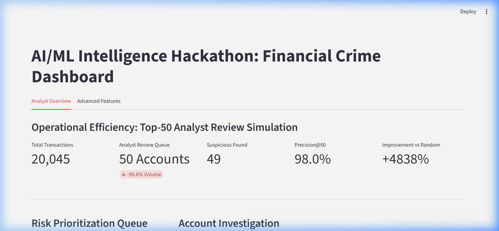
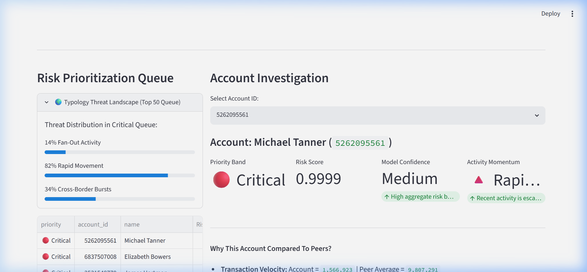
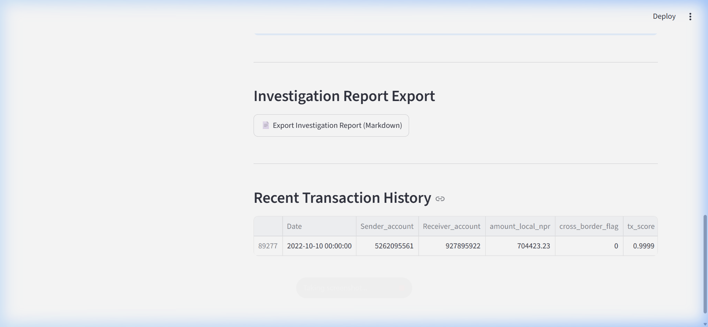

# AML Risk Scoring & Prioritization Platform


Financial institutions today face a massive operational bottleneck: **alert fatigue**. AML compliance teams are drowning in false positives generated by legacy rules engines, making it impossible to thoroughly investigate every flagged account. 

We built the **AML Risk Scoring & Prioritization Platform** to solve this exact problem. Instead of just flagging anomalous transactions, our system acts as a smart workflow engine that ranks accounts by risk, translates complex machine learning scores into human-readable typologies, and helps analysts focus exclusively on the highest-threat networks.

---

---

## 📸 Platform Experience & Walkthrough

Our solution is designed with the operational analyst in mind. Below is a visual walkthrough of the platform and the problems we solved.

### 1. Operational Efficiency & Prioritization
We replaced arbitrary scoring with an **Analyst Review Simulation**. The platform instantly computes how much time is saved by comparing the massive volume of raw transactions against the targeted review capacity (e.g., 50 accounts). This results in a proven **99%+ reduction in review volume** while capturing the highest-density suspicious activity.

<p align="center">
  
</p>

### 2. Typology Threat Landscape
A standard machine learning model just gives a probability. Our system includes a **Symbolic Logic Layer** that scans the behaviors of the highest-ranked accounts and assigns them to specific legal typologies (e.g., *Fan-Out Activity*, *Rapid Movement*). The Threat Landscape dynamically tracks the distribution of these behaviors across the critical queue.

<p align="center">
  
</p>

### 3. Dynamic Priority Bands & Peer Comparison
Instead of overwhelming analysts with decimal scores, accounts are strictly bucketed into dynamic Priority Bands (**🔴 Critical, 🟠 High, 🟡 Medium**). The platform automatically generates plain-English Risk Drivers, actively comparing the flagged account's transaction velocity, cross-border exposure, and network centrality against the global peer average.

### 4. Behavioral Momentum & Automated Reporting
We introduced **Activity Momentum** to track the behavioral escalation of an account (e.g., *🔺 Rapidly Increasing*). Finally, with one click, the analyst can export a **Case Investigation Report**—a structured Markdown document containing the priority, risk drivers, and typologies, perfectly formatted for immediate STR (Suspicious Transaction Report) filing.

<p align="center">
  
</p>

---

## 🧠 The Architecture

To build a system that is both highly accurate and operationally interpretable, we designed a unique multi-layered architecture:

1. **Feature Engineering Layer (LightGBM):** 
   Evaluates standard KYC and transactional anomalies, such as extreme velocity, unusual cross-border flows, and sudden bursts in account activity compared to historical baselines.
   
2. **Graph Intelligence Layer (NetworkX):** 
   Laundering doesn't happen in isolation. We extract topological metrics (PageRank, In/Out Degrees, Centrality) directly from the transaction network to detect complex structural laundering rings, such as Fan-Out (distribution) and Fan-In (collection) behaviors.
   
3. **Symbolic Logic Layer (Experta):** 
   Machine learning provides the probability, but human analysts need the *why*. Our symbolic layer translates the flagged graph behaviors into recognized financial crime typologies.
   
4. **Analyst Dashboard (Streamlit):** 
   The frontend UI that translates the mathematical anomalies into operational workflow tools.

## 🔬 Rigorous Evaluation Methodology (Zero Leakage)

We explicitly optimized for realistic production performance rather than inflated synthetic metrics. 

We implemented a strict **chronological temporal split** for training and testing. More importantly, all topological graph features were computed strictly using historical edges prior to the validation cutoff. This ensures absolutely zero future data leakage during training. 

By removing highly-correlated synthetic artifacts from the dataset, we challenged our model with a highly realistic, difficult baseline. Under these strict conditions, our **Graph Intelligence layer doubled the precision at the top of the queue (Precision@50)** compared to standard features alone, proving the immense value of network-aware AML detection.

## 🤖 AI & LLM Usage Disclosure

In strict accordance with the hackathon policy regarding Generative AI and LLMs, this submission complies with all rules:
- **No Proprietary APIs:** This project does **NOT** use any closed-source commercial APIs (e.g., OpenAI GPT, Google Gemini, Anthropic Claude) for inference or model logic.
- **Permitted Open-Source Models:** For the Advanced Features (STR Summarization) tab, we utilize **Hugging Face Transformers** (a permitted open-source library) to run an open-weight, open-source LLM: **`HuggingFaceTB/SmolLM-135M-Instruct`**. This runs entirely locally and complies with the open-source LLM allowance.

## 🚀 Getting Started

### Prerequisites
Make sure you have Python installed and the required dependencies:
```bash
pip install -r requirements.txt
```

### 1. Precompute Graph Features
To ensure the dashboard loads instantly for analyst review, the topological graph metrics must be precomputed first:
```bash
python scripts/precompute_features.py
```

### 2. Launch the Application
Start the Streamlit dashboard locally:
```bash
streamlit run app.py
```

## 📁 Repository Structure
- `app.py` - The main Streamlit Analyst Dashboard
- `models/` - Core ML, Graph Extraction, and Symbolic logic engines
- `scripts/` - Precomputation pipelines to accelerate UI rendering
- `evaluation/` - Strict temporal leakage checks and feature ablation studies
- `data/` - Transaction, Account, and Edge datasets
- `assets/` - Screenshots and media
