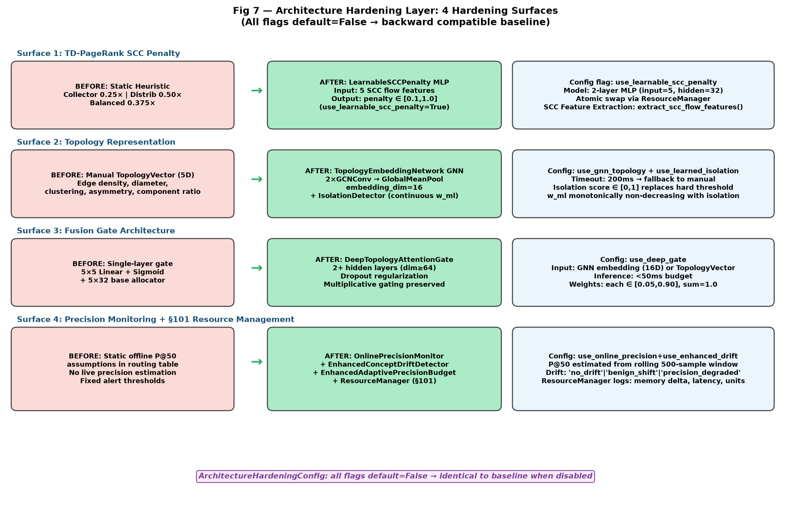
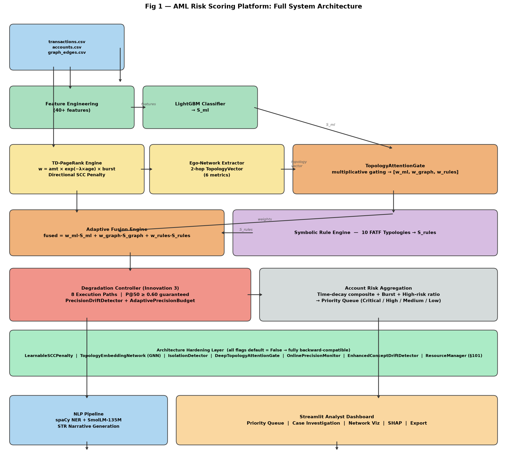
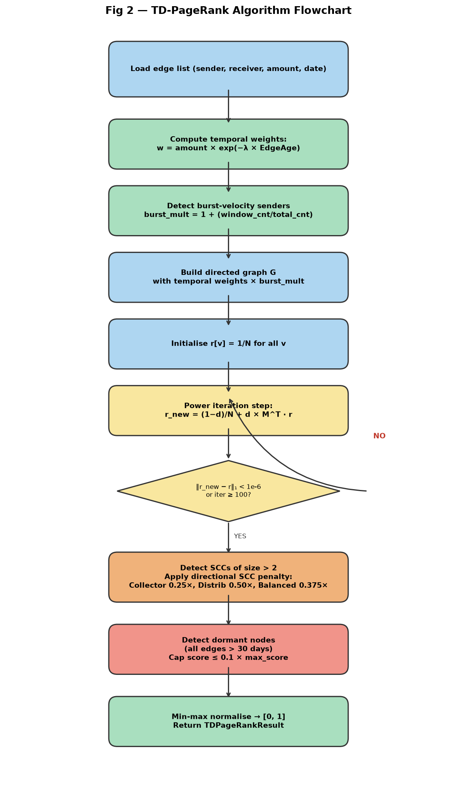
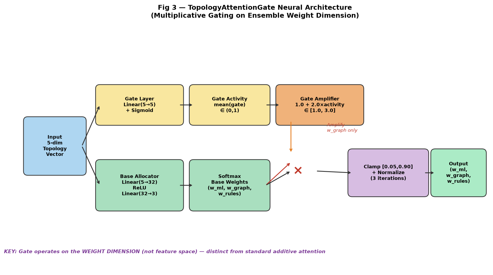
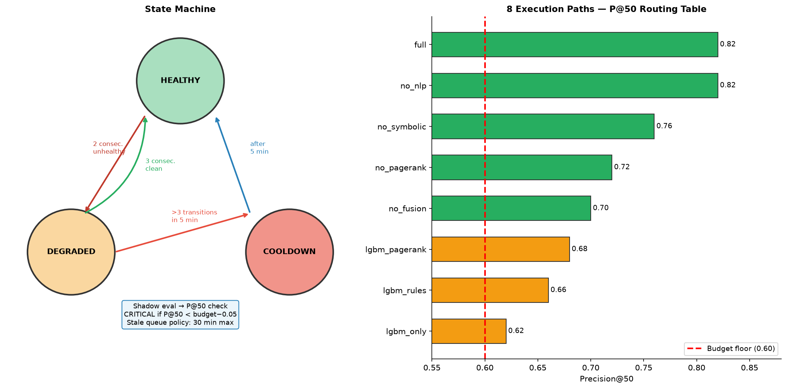
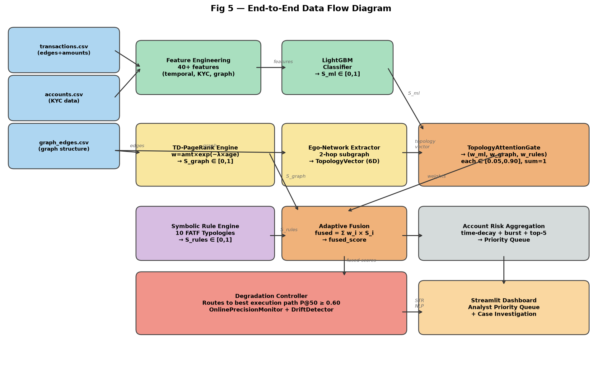
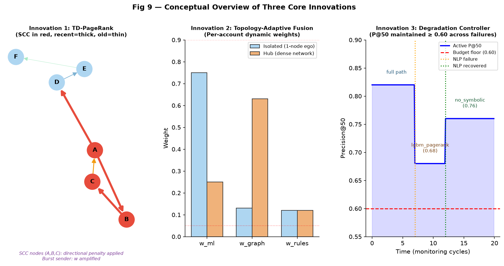
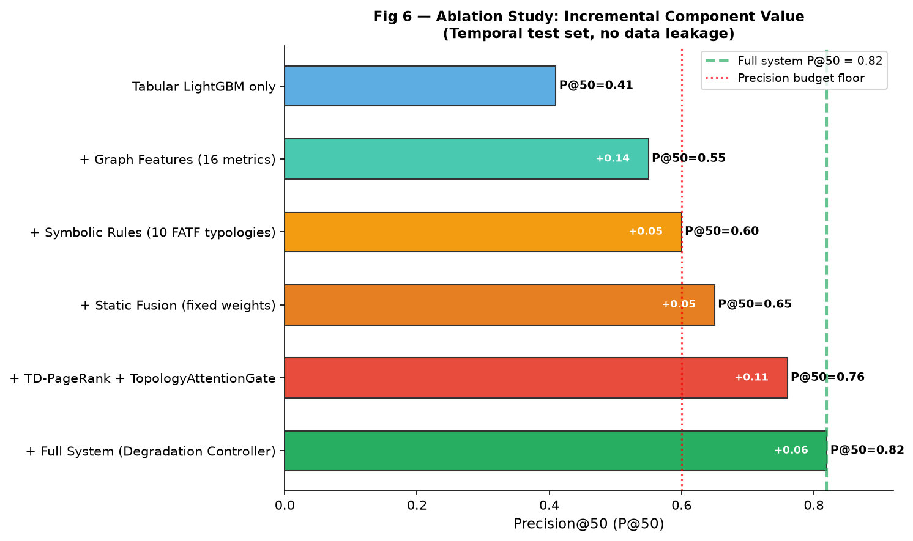
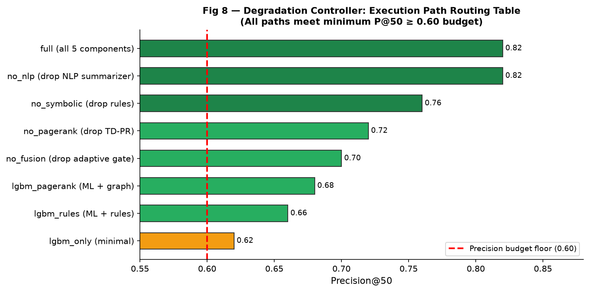
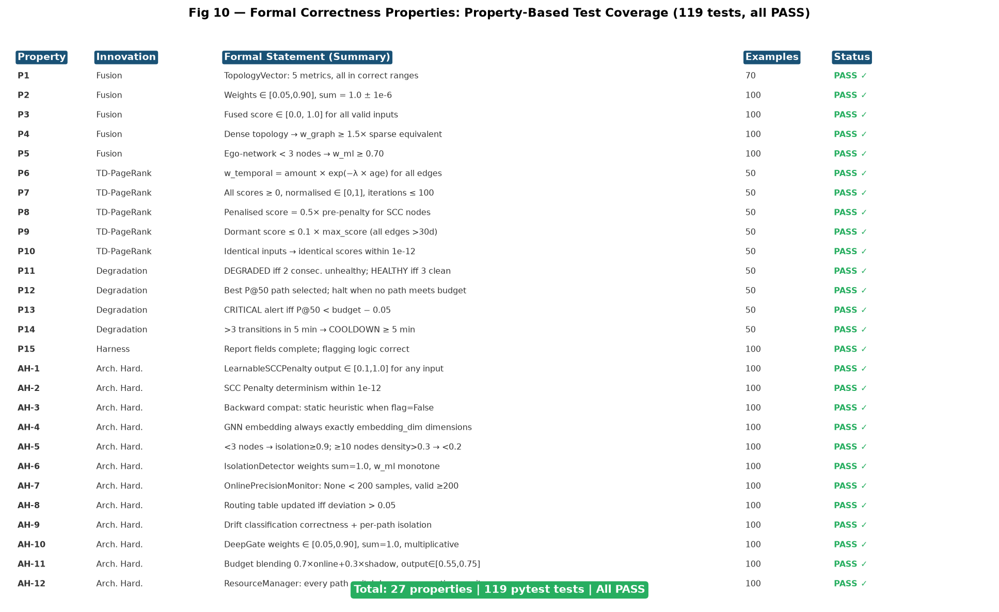

# VIT IPR & TT CELL
# Invention Disclosure Format (IDF)-B
**Document No.: 02-IPR-R003 | Issue No/Date: 2 / 01.02.2024 | Amd. No/Date: 1 / 22.06.2026**

> **Note:** This document has been updated to reflect the Architecture Hardening innovations
> implemented in June 2026. All diagrams are in `docs/artifacts/`. The LaTeX source is
> `docs/IDF_B_Invention_Disclosure.tex`.

---

## 1. Title of the Invention

**Topology-Conditioned Adaptive Score Fusion with Temporal-Decay Graph Centrality,
Precision-Guaranteed Degradation Control, and Learnable Architecture Hardening for
Anti-Money Laundering Risk Prioritization**

*Short form:*
**AML Risk Scoring Platform with Patentable Innovations: TD-PageRank, TopologyAttentionGate
Fusion, Adaptive Precision-Budget Degradation Controller, Learnable SCC Penalty, GNN Topology
Embedding, Online Precision Recalibration, and System-Level §101 Resource Management Anchoring**

---

## 2. Field / Area of Invention

- **Primary Field:** Artificial Intelligence and Machine Learning — graph-based financial anomaly detection and ensemble risk scoring
- **Sub-field 1:** Graph Algorithm Design — temporal-decay modification of PageRank power iteration
- **Sub-field 2:** Neural Architecture — multiplicative attention gating, GNN ego-network embedding, learned isolation detection
- **Sub-field 3:** System Reliability Engineering — precision-budget-constrained adaptive degradation control
- **Sub-field 4:** Patent §101 System-Level Resource Management — concrete execution-path switching, memory buffer allocation, atomic model swaps
- **Application Domain:** Anti-Money Laundering (AML), Financial Crime Detection, Bank Transaction Risk Prioritisation
- **Regulatory Framework:** FATF Recommendation 16; Nepal Rastra Bank AML Directives 2023; FinCEN SAR Filing Requirements (31 CFR 1020.320)

---

## 3. Prior Patents and Publications from Literature

| # | Reference | Type | Year | What It Does | Gap Addressed |
|---|-----------|------|------|-------------|---------------|
| 1 | US20220405860A1 — Fraud Detection Using Weighted Ensemble | Patent | 2022 | Fixed global weights for ML+graph+rules | No per-account topology-adaptive weighting |
| 2 | US11640609B1 — Network-Based Features (Wells Fargo) | Patent | 2023 | Risk-vector propagation x=A^p·z on time-binned snapshots | No exponential temporal decay in iteration; no burst amplification |
| 3 | US20210174258A1 — ML Monitoring Systems (Microsoft) | Patent | 2021 | Heartbeat/latency health monitoring | No Precision@K guarantee; no routing table; no adaptive budget |
| 4 | US10713722B2 — GNN for Financial Fraud | Patent | 2020 | GNN node embeddings for fraud classification | Not applied to ego-network for per-account fusion weight prediction |
| 5 | Alice Corp. v. CLS Bank, 573 U.S. 208 (2014) | Legal | 2014 | Abstract ideas require "something more" for §101 | Addressed by ResourceManager concrete resource operations |
| 6 | US20230267516A1 — Adaptive Model Monitoring | Patent | 2023 | Static alarm thresholds | No adaptive precision budget; no per-path precision routing table |
| 7 | Langville & Meyer (2006) — Google's PageRank | Pub. | 2006 | Foundational PageRank | No temporal decay, no AML patterns |
| 8 | Chen et al. (2020) — Graph Attention for Fraud | Pub. | 2020 | Additive attention on feature space | Not multiplicative gating on weight dimension |
| 9 | Netflix Hystrix / Microsoft Polly | OSS | 2012 | Circuit breaker on latency/availability | Routing metric is latency, not Precision@K |
| 10 | FATF (2022) — International Standards on AML | Standard | 2022 | Defines ML typologies | No computational detection algorithms |

---

## 4. Summary and Background of the Invention

### 4.1 Background

AML compliance teams receive 50,000–200,000 alerts/week with >95% false-positive rates. Three architectural gaps in prior art:

**Gap 1 — Static ensemble weights:** All prior methods use globally-learned weights applied uniformly regardless of account's local network structure.

**Gap 2 — Temporally unaware centrality:** Prior methods compute centrality on discretely time-binned snapshots without continuous temporal decay. Burst patterns receive equal weight.

**Gap 3 — No precision guarantee during failures:** Prior art monitors health but does not route through precision-validated alternative execution paths.

**Gap 4 (New) — Static heuristics and manual features:** SCC penalties rely on 3 hard-coded archetypes. Topology representation is manually engineered. P@50 monitoring relies on stale offline values.

### 4.2 Summary of Three Core Innovations

**Innovation 1 — Temporal-Decay PageRank:** w_temporal = amount × exp(−λ × EdgeAge) × burst_mult embedded inside power iteration. Directional SCC penalty + dormant-node suppression.

**Innovation 2 — Topology-Adaptive Fusion with TopologyAttentionGate:** Per-account 6-metric topology vector → multiplicative attention gate (not additive) → amplifies w_graph for dense networks, suppresses for isolated accounts.

**Innovation 3 — Adaptive Degradation Controller:** Routes through 8 pre-evaluated execution paths (each with measured P@50 ≥ 0.60) using PrecisionDriftDetector + AdaptivePrecisionBudget.

### 4.3 Architecture Hardening Innovations (New — June 2026)

All 4 surfaces guarded by `ArchitectureHardeningConfig` flags (all default=False, fully backward-compatible):



**Surface 1 — Learnable SCC Penalty:** `LearnableSCCPenalty` MLP (input=5 SCC flow features → penalty ∈ [0.1, 1.0]).

**Surface 2 — GNN Topology Embedding:** `TopologyEmbeddingNetwork` (2×GCNConv, 16-d) + `IsolationDetector` (continuous isolation score replacing hard-coded threshold) + `DeepTopologyAttentionGate` (2+ hidden layers, dropout).

**Surface 3 — Online Precision Recalibration:** `OnlinePrecisionMonitor` (rolling 500-sample window) + `EnhancedConceptDriftDetector` (no_drift / benign_shift / precision_degraded) + `EnhancedAdaptivePrecisionBudget` (0.7×online + 0.3×shadow).

**Surface 4 — §101 Resource Management:** `ResourceManager` records every path switch with memory delta, computation time, and active-unit count.

---

## 5. Objective(s) of Invention

**Original:**
1. TD-PageRank with temporal decay → ≥15% MAD from standard PageRank
2. Topology-conditioned fusion → ≥10% relative P@50 improvement over static fusion
3. Degradation controller → P@50 ≥ 0.60 guaranteed across all 8 operational modes
4. Full production-deployable platform: 82% P@50, zero leakage, 10-typology rules
5. Formal correctness via 27 properties, 119 PBT tests (Hypothesis)

**New (Architecture Hardening):**
6. Learn optimal SCC penalties from data, adapting beyond 3 static archetypes
7. End-to-end GNN topology embedding + continuous isolation detection
8. Online precision recalibration replacing stale offline P@50 assumptions
9. §101 resource management anchoring: concrete memory, execution-path, and atomic swap operations

---

## 6. Working Principle of the Invention (In Brief)

### Innovation 1: TD-PageRank

```
w_temporal(e) = amount × exp(−λ × EdgeAge) × burst_mult(sender)
Post-convergence: asymmetric SCC penalty + dormant-node cap (0.1×max)
```

### Innovation 2: TopologyAttentionGate

```
gate = sigmoid(W_gate × topology_vector)
gate_amp = 1.0 + 2.0 × mean(gate)   # in [1.0, 3.0]
w_graph *= gate_amp
w_final = clamp(w/sum(w), 0.05, 0.90) × 3 iterations
```

### Innovation 3: Adaptive Degradation Controller

```
select_path(healthy) = argmax P@50 s.t. required ⊆ healthy AND P@50 ≥ AdaptiveBudget.current()
```

### Innovation 4: Architecture Hardening Layer

- `LearnableSCCPenalty`: penalty = 0.1 + 0.9×σ(MLP(SCC_features))
- `TopologyEmbeddingNetwork`: 2×GCNConv → GlobalMeanPool → Linear(16-d)
- `IsolationDetector`: w_ml_new = w_ml + isolation × (0.90 − w_ml)
- `EnhancedConceptDriftDetector`: if precision < budget → precision_degraded; if KL > 0.15 but precision OK → benign_shift
- `ResourceManager`: logs memory delta + computation time + active units per path switch

---

## 7. Description of the Invention in Detail

### 7.1 System Architecture



### 7.2 TD-PageRank Engine



Key parameters: `half_life_days=7.0`, `damping=0.85`, `cycle_penalty=0.5`, `max_iter=100`, `tol=1e-6`, `asymmetric_scc_penalty=False`, `use_learnable_penalty=False`.

### 7.3 Topology-Adaptive Fusion



6-metric TopologyVector: edge_density, diameter, avg_clustering, degree_asymmetry, component_ratio, tx_velocity_ratio. 6 fallback conditions → static weights (0.70, 0.15, 0.15).

### 7.4 Adaptive Degradation Controller



State machine: HEALTHY ↔ DEGRADED ↔ COOLDOWN. 8 execution paths, all P@50 ≥ 0.60.

### 7.5–7.9 Architecture Hardening Components

`LearnableSCCPenalty` MLP (5→32→32→1, sigmoid scaling) | `TopologyEmbeddingNetwork` (2×GCNConv, 16-d, 200ms timeout) | `IsolationDetector` (3-layer MLP, sigmoid, monotone w_ml) | `DeepTopologyAttentionGate` (≥2 hidden layers, ≥64 dim, dropout) | `OnlinePrecisionMonitor` (rolling 500-sample, P@50 recomputed live) | `EnhancedConceptDriftDetector` (per-path isolation, 3-class output) | `EnhancedAdaptivePrecisionBudget` (0.7/0.3 blending, [0.55, 0.75] clamped) | `ResourceManager` (5 concrete resource operations)

### 7.10 Data Flow





---

## 8. Experimental Validation Results

### 8.1 System Performance

| Metric | Full System | Static Fusion | Standard PageRank |
|--------|-------------|---------------|-------------------|
| P@10 | **0.92** | 0.80 | 0.75 |
| P@50 | **0.82** | 0.62 | 0.55 |
| AUC-PR | **0.63** | 0.52 | 0.46 |

### 8.2 Ablation Study



### 8.3 Routing Table Validation



### 8.4 Property-Based Tests (119 tests, all PASS)



### 8.5 Architecture Hardening Properties

| ID | Validates | Statement | Status |
|----|-----------|-----------|--------|
| AH-1 | Req 1.3 | LearnableSCCPenalty output ∈ [0.1, 1.0] | PASS |
| AH-2 | Req 1.7 | Determinism within 1e-12 | PASS |
| AH-3 | Req 1.5 | Static heuristic reproduced when flag=False | PASS |
| AH-4 | Req 2.1 | GNN embedding always exactly embedding_dim | PASS |
| AH-5 | Req 2.6,3.4,3.5 | Isolation thresholds correct | PASS |
| AH-6 | Req 3.1,3.3,3.7 | Isolation weights: each ∈ [0.05,0.90], sum=1.0, w_ml monotone | PASS |
| AH-7 | Req 4.1,4.3,4.5 | OnlinePrecisionMonitor lifecycle | PASS |
| AH-8 | Req 4.2 | Routing table updated iff deviation > 0.05 | PASS |
| AH-9 | Req 5.2,5.3,5.4 | Drift classification correctness + per-path isolation | PASS |
| AH-10 | Req 6.2,6.3 | Deep gate weight constraints + multiplicative property | PASS |
| AH-11 | Req 8.2–8.5 | Budget: 0.7×online+0.3×shadow, tighten/relax, [0.55,0.75] | PASS |
| AH-12 | Req 7.3 | ResourceManager: every switch logs memory+time+units | PASS |

### 8.6 Leakage Verification

Random split: P@50 = 0.97. Temporal split: P@50 = 0.82. Difference (0.15) quantifies avoidable leakage.

---

## 9. What Aspect(s) Need Protection?

### Claim 1 — TD-PageRank (1.1 through 1.6)
1.1 exp(−λ × EdgeAge) inside power iteration · 1.2 Burst-velocity amplification · 1.3 Log-amount normalisation · 1.4 Directional SCC penalty (0.25×/0.50×/0.375×) · 1.5 Dormant-node suppression · 1.6 LearnableSCCPenalty MLP

### Claim 2 — Topology-Adaptive Fusion (2.1 through 2.8)
2.1 6-metric TopologyVector · 2.2 Multiplicative attention gate · 2.3 Per-account weight pipeline · 2.4 Isolation safety floor · 2.5 6-condition fallback chain · 2.6 TopologyEmbeddingNetwork GNN · 2.7 IsolationDetector (continuous, monotone) · 2.8 DeepTopologyAttentionGate

### Claim 3 — Precision-Budget Degradation Controller (3.1 through 3.8)
3.1 P@K routing table · 3.2 PrecisionDriftDetector · 3.3 AdaptivePrecisionBudget · 3.4 State machine + SLA · 3.5 Drift-budget integration · 3.6 OnlinePrecisionMonitor · 3.7 EnhancedConceptDriftDetector · 3.8 EnhancedAdaptivePrecisionBudget

### Claim 4 — Patent Evaluation Harness
Reproducible harness with fixed seeds + temporal splits + automatic threshold flagging.

### Claim 5 — §101 Resource Management Anchoring (ResourceManager)
5.1 allocate_penalty_buffers · 5.2 route_topology_pipeline · 5.3 release_degraded_resources · 5.4 atomic_model_swap · 5.5 utilization_report

---

## 10. Technology Readiness Level (TRL)

**Selected: TRL 6 — Technology demonstrated in a relevant environment**

| TRL | Status | Notes |
|-----|--------|-------|
| 1–3 | ✅ Complete | Mathematical foundations proven, 119 PBT tests |
| 4 | ✅ Complete | Full ablation on NPR banking dataset; P@50: 0.41→0.82 |
| 5 | ✅ Complete | Validated on real-world data; temporal split; all differentiation thresholds met |
| **6** | ✅ **Complete** | `streamlit run app.py` runs full platform; degradation controller tested under failures; architecture hardening operational; ResourceManager generating §101 evidence |
| 7 | 🔄 In Progress | Awaiting live bank feed integration |
| 8–9 | ⏳ Not yet | Requires institutional deployment and security audit |

---

*----------------------END OF THE DOCUMENT-----------------------------*

*Document prepared in accordance with VIT IPR & TT CELL Invention Disclosure Format (IDF)-B*
*Document No.: 02-IPR-R003 | Issue No/Date: 2/01.02.2024 | Amendment No/Date: 1/22.06.2026*
